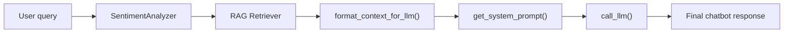

# LLM Generation & Evaluation Module

## Overview

This module implements the **sentiment-aware response generation** component of our restaurant recommendation chatbot. It uses **action-oriented dynamic prompting** to adapt both the tone and behavior of responses based on user emotional state.

**Key Innovation:** Instead of just changing *how* the bot sounds, we change *what* the bot does—number of recommendations, level of detail, and interaction strategy—based on detected sentiment.

This module interacts with other project components:
- `sentiment_analysis` (for sentiment detection)
- `rag` (for retrieving restaurant context)

It is orchestrated by:
- The main `app.py` (interactive chatbot)
- The evaluation scripts in project root (`run_eval.py`, `evaluate_ablation.py`)

---

## 📂 Directory Structure
```
📦llm
 ┣ 📜clean.py # Context formatting utilities
 ┣ 📜generate.py # Gemini API wrapper
 ┗ 📜prompt.py # Dynamic prompt templates
```
---

## 🔧 Core Components
- ```generate.py```: Direct API connector to the Google Gemini models. Its ```call_llm()``` function is the engine that generates all text
- ```prompts.py```: Defines the logic for both our experimental bots:
  - ```BASELINE_SYSTEM_PROMPT``` (Bot A): A simple, RAG-only prompt that is factual, concise, and has no emotional persona
  - ```SENTIMENT_PROMPTS``` (Bot B): A dictionary of 'action-oriented' prompts (```positive```, ```neutral```, ```negative```) that instructs LLM to change its behavior and tone based on user's feelings
  - ```get_system_prompt()```: Function that selects and combines the correct prompts for Bot B
- ```clean.py```: A helper module containing the ```format_context()``` function. This script cleans and de-duplicates the list of review chunks from the RAG module (```retriever.py```) and formats it into a clean, readable string for the LLM.

---

## 🔄 The Generation Pipeline (How It Works)



When a user query is received by the main ```app.py```, this module is used in the final step:
1. ```app.py``` gets the ```user_sentiment``` (e.g., 'negative') from the ```SentimentAnalyzer```.
2. ```app.py``` gets the ```context_list``` from the ```Retriever```.
3. ```clean.py``` is called to format the ```context_list``` into a ```formatted_string```.
4. ```prompts.py```'s ```get_system_prompt()``` function is called with the ```user_sentiment``` to select the correct persona (e.g., the 'negative' prompt).
5. ```generate.py```'s ```call_llm()``` function is finally called with this system prompt and the ```formatted_string``` to produce the final answer.

---
 
## Role in Evaluation
This module is the "system under test" for the entire A/B evaluation pipeline. The evaluation scripts in the root directory (`run_eval.py` and `evaluate_ablation.py`) import funtions from this folder to conduct the A/B test. 
- `run_evaluation.py` calls `generate.py` twice (once with `BASELINE_SYSTEM_PROMPT` and once with `get_system_prompt()`) -> raw output is saved to `llm_results/evaluation_results.csv`
- `evaluate_ablation.py` imports `clean.py` and `prompts.py` to re-run the logic and calculate objective metrics like "Policy Compliance" based on the prompt rules defined here -> raw output is saved to `llm_results/eval_metrics_detailed.csv`

---

## 📊 Evaluation Results

### Ablation Study (A/B Test)

**Methodology:**
- **Design:** 9 representative queries (3 positive, 3 negative, 3 neutral)
- **Evaluators:** 31 human raters
- **Total Votes:** 279 (9 queries × 31 evaluators)
- **Comparison:** Side-by-side preference test (randomized order)
- **Question:** "Which response is more helpful and appropriate?"

**Bot Versions:**
- **Bot A (Baseline):** RAG-only system with base instruction (no sentiment adaptation)
- **Bot B (Sentiment-Aware):** Full system with dynamic, action-oriented prompts

---

### Overall Preference

| Bot Version | Votes | Percentage |
|-------------|-------|------------|
| **Bot A (Baseline)** | **131** | **47.0%** |
| Bot B (Sentiment-Aware) | 123 | 44.1% |
| Both Equally Good | 20 | 7.2% |
| Both Equally Bad | 5 | 1.8% |

**Interpretation:** Baseline narrowly won overall, but the **3% margin** combined with **7.2% "equally good"** suggests neither approach is categorically superior—effectiveness depends on query context.

---

### Performance by Sentiment

| Query Sentiment | Bot B Preference | Bot A Preference | Bot B % |
|-----------------|------------------|------------------|---------|
| **Positive** 😊 | **52** | 41 | **55.9%** ✅ |
| **Negative** 😫 | 35 | **58** | **37.6%** ❌ |
| **Neutral** 😐 | 36 | **57** | **38.7%** ❌ |

---

### Key Findings

#### ✅ **Success: Positive Queries (55.9%)**

**Example Query:** *"I just aced my exam! Where can I get a huge, celebratory burger?"*

**Bot B Response:**
> "That's absolutely amazing news about your exam! You deserve an incredible celebration! You HAVE to check out **Village Whiskey** in Philadelphia! You will love it there for a celebratory burger of a lifetime! It's the perfect spot to indulge in a truly unforgettable burger experience."

**Why It Worked:**
- ✅ Matched user's high energy and excitement
- ✅ Provided specific details quoted from reviews ("burger of a lifetime")
- ✅ **Higher factual grounding:** Jaccard similarity 0.171 vs 0.078 (baseline)
- ✅ Users appreciated descriptive, enthusiastic recommendations for exploratory queries

**Insight:** When users are in positive emotional states, they want to be *excited* about options, not just *informed*. Descriptive enthusiasm enhances engagement without compromising accuracy.

---

#### ❌ **Failure: Negative Queries (37.6%)**

**Example Query:** *"I'm too tired to even read a menu. Please suggest one simple, comforting dish for me in King of Prussia."*

**Bot B Response:**
> "Oh, when you're too tired to even think, you absolutely need a trip to **Founding Farmers King of Prussia**! Their amazing dinners are so incredibly comforting, they're enough to make you moan with your eyes closed. And for an extra hug, their desserts are pure bliss and will make you cry for your mommy – in the best way possible!"

**Why It Failed:**
1. ❌ **Explicit empathy backfired:** "Make you cry for your mommy" felt overly casual/patronizing
2. ❌ **Over-enthusiasm tone-deaf:** User was exhausted, not excited—mismatch in energy level
3. ❌ **Restricted choice reduced agency:** Limiting to 1-2 options felt constraining vs. helpful
4. ✅ **Baseline's neutral efficiency preferred:** Users in negative states prioritize quick, actionable info over emotional commentary

**Critical Insight:** **Emotional alignment ≠ emotional commentary**  
True empathy for stressed users means adjusting *behavior* (prioritizing convenient options) without *stating* their emotional state. Show empathy through action, not words.

---

#### ❌ **Failure: Neutral Queries (38.7%)**

**Example Query:** *"I don't know what I want... maybe Thai? Mexican? I cannot decide."*

**Bot B Response (with clarifying logic):**
> "That sounds tough, trying to decide when you're feeling overwhelmed. If you're leaning towards Thai, Phu Fha Thai Restaurant in Philadelphia sounds like a truly comforting choice..."

**Why It Failed:**
1. ❌ **Clarifying questions added friction:** When users expected direct answers, follow-up questions felt evasive
2. ❌ **"Neutral" sentiment too ambiguous:** Could mean casual browsing, genuine indecision, or pragmatic efficiency—one prompt couldn't handle all
3. ✅ **Baseline's straightforward approach safer:** For factual queries, direct answers outperformed personality-driven responses

**Insight:** Neutral sentiment requires **intent classification** (indecisive vs. factual) before applying adaptive logic. Single approach for diverse neutral states creates systematic mismatches.

---

### Quantitative Metrics

Beyond human preference, we measured objective quality using automated evaluation:

| Metric | Bot A (Baseline) | Bot B (Sentiment-Aware) |
|--------|------------------|-------------------------|
| **Grounding Score** (Jaccard bigram) | 0.066 | **0.101** ✅ |
| **Hallucination Rate** | 4.2% | 4.2% |
| **Policy Compliance** | 45.8% | 50.0% |
| **Sentiment Adherence** | 29.2% | **58.3%** ✅ |
| **Overload Rate** (too verbose) | 0% | 8.3% ⚠️ |

**Key Takeaways:**
- ✅ Bot B achieved **higher grounding scores**, meaning more specific evidence pulled from reviews (not just fluff)
- ✅ Bot B had **higher sentiment adherence** (58.3% vs 29.2%)—responses matched expected emotional tone
- ⚠️ Bot B violated **overload policy** more (8.3%)—positive prompts sometimes generated overly long responses
- ✅ **No increase in hallucinations**—sentiment-awareness didn't compromise factual accuracy

---

## ⚠️ Limitations
1. **Explicit Empathy Backfires (Negative Queries)**
   - Validation phrases ("That sounds so tiring") perceived as patronizing
   - Users in task-oriented contexts prefer action over commentary
   - **37.6% preference** vs 62.4% for neutral baseline

2. **Over-Constrained Recommendations**
   - Limiting to 1-2 options for negative queries reduced user agency
   - Even stressed users want sufficient choice to feel in control

3. **Neutral Sentiment Ambiguity**
   - Single "neutral" prompt cannot handle:
     - Casual information-seeking ("What restaurants are in X?")
     - Genuine indecision ("I can't decide between Thai or Mexican")
     - Pragmatic efficiency ("Just suggest something quick")
   - Clarifying questions added friction for factual queries

4. **Sentiment Misclassification Cascade**
   - When sentiment analyzer is wrong (18.7% error rate), everything downstream fails
   - Example: "I'm excited for my birthday!" detected as **negative** → bot gave stress-reduction response for celebration query

5. **Overload Policy Violations**
   - Positive-sentiment prompts sometimes generated overly long responses (8.3% overload rate)
   - Trade-off between enthusiasm and conciseness
     
