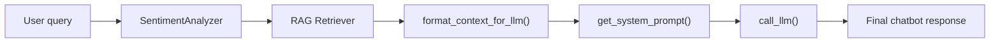

# LLM Generation & Evaluation Module

## Overview
This directory contains all the code responsible for the 'brain' of the sentiment-aware chatbot: the component that generate the final LLM response.

This module interacts with other project components:
- ```sentiment_analysis``` (for sentiment detection)
- ```rag``` (for retrieving restaurant context)

It is orchestrated by:
- the main ```app.py``` (online chatbot)
- the evaluation scripts in the project root (`run_eval.py`, `evaluate_ablation.py`)

## Directory Structure
```
📦llm
 ┣ 📜clean.py
 ┣ 📜generate.py
 ┗ 📜prompt.py
```

## Core Components
- ```generate.py```: Direct API connector to the Google Gemini models. Its ```call_llm()``` function is the engine that generates all text
- ```prompts.py```: Defines the logic for both our experimental bots:
  - ```BASELINE_SYSTEM_PROMPT``` (Bot A): A simple, RAG-only prompt that is factual, concise, and has no emotional persona
  - ```SENTIMENT_PROMPTS``` (Bot B): A dictionary of 'action-oriented' prompts (```positive```, ```neutral```, ```negative```) that instructs LLM to change its behavior and tone based on user's feelings
  - ```get_system_prompt()```: Function that selects and combines the correct prompts for Bot B
- ```clean.py```: A helper module containing the ```format_context()``` function. This script cleans and de-duplicates the list of review chunks from the RAG module (```retriever.py```) and formats it into a clean, readable string for the LLM.

## The Generation Pipeline (How It Works)



When a user query is received by the main ```app.py```, this module is used in the final step:
1. ```app.py``` gets the ```user_sentiment``` (e.g., 'negative') from the ```SentimentAnalyzer```.
2. ```app.py``` gets the ```context_list``` from the ```Retriever```.
3. ```clean.py``` is called to format the ```context_list``` into a ```formatted_string```.
4. ```prompts.py```'s ```get_system_prompt()``` function is called with the ```user_sentiment``` to select the correct persona (e.g., the 'negative' prompt).
5. ```generate.py```'s ```call_llm()``` function is finally called with this system prompt and the ```formatted_string``` to produce the final answer.

 
## Role in Evaluation
This module is the "system under test" for the entire A/B evaluation pipeline. The evaluation scripts in the root directory (`run_eval.py` and `evaluate_ablation.py`) import funtions from this folder to conduct the A/B test. 
- `run_evaluation.py` calls `generate.py` twice (once with `BASELINE_SYSTEM_PROMPT` and once with `get_system_prompt()`) -> raw output is saved to `llm_results/evaluation_results.csv`
- `evaluate_ablation.py` imports `clean.py` and `prompts.py` to re-run the logic and calculate objective metrics like "Policy Compliance" based on the prompt rules defined here -> raw output is saved to `llm_results/eval_metrics_detailed.csv`
